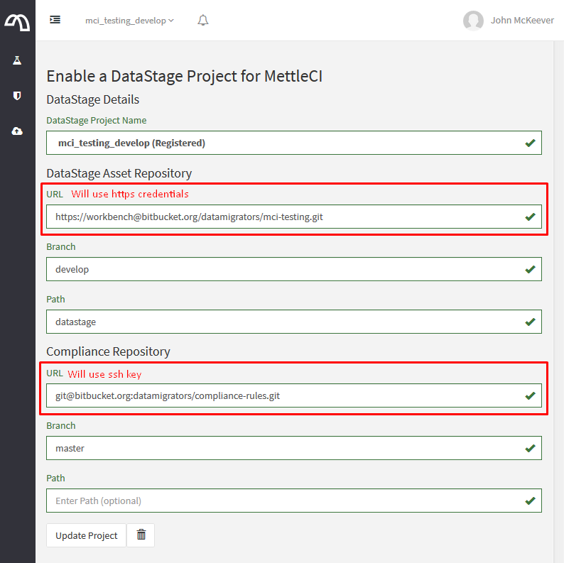

# Configuring MettleCI Workbench to communicate with Git over HTTPS (legacy)

**Note**

This page describes the functionality of MettleCI Workbench **up to and
including version 1.0-1279**.  
For Workbench version 1.0-1280 and newer see this page: <a
href="Configuring_MettleCI_Workbench_to_communicate_with_Git_over_HTTPS"
data-linked-resource-id="1745747969" data-linked-resource-version="25"
data-linked-resource-type="page">Configuring MettleCI Workbench to
communicate with Git over HTTPS</a>

We recommend using the SSH protocol for authentication between MettleCI
Workbench and your remote Git repositories as it is easier to manage
access in a uniform manner across multiple remote Git repository hosts
(Github, Bitbucket, Gitlab, etc). SSH keys also tend to be more secure
than username/password credentials.

In the event that you need to use Git HTTPS rather than SSH, you can
configure MettleCI Workbench to use a single set of username/password
credentials for all Git HTTPS requests by modifying the `config.yml` as
shown below:

``` java
...
gitAuthentication:
  sshKey: "/opt/dm/mci/workbench.key"
  httpsUsername: <Workbench Git Username>
  httpsPassword: <Workbench Git Password>
...
```

MettleCI Workbench will need to be restarted after saving changes to
`config.yml`.

You can then enter Git HTTPS or SSH repository URLS in the project
registration page. The ssh or https credentials will be used depending
on the configured Git protocol, any username shown in the URL will be
ignored and overridden by the settings included in `config.yml`:



Ensure that the Git Repository Server is reachable on Port 443 for HTTPS
or Port 80 for HTTP or Port 21 for FTP

**Tip**  
While most Git repository hosts only support HTTPS and SSH protocols,
MettleCI Workbench also supports HTTP and FTP. The same `httpsUsername`
and `httpsPassword` credentials are used, the only difference is the
registered Git URL will be prefixed with http:// or ftp:// protocols.

## Attachments:


[image-20201015-010421.png](attachments/1112375301/1112277028.png)
(image/png)  

[image-20201015-011343.png](attachments/1112375301/1109557371.png)
(image/png)  
