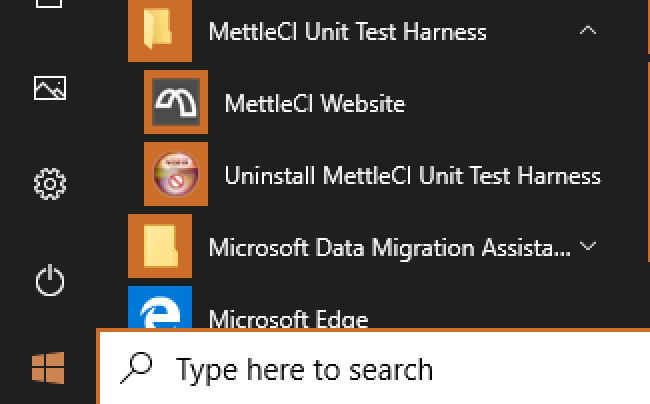

# Installing or Upgrading the Parallel Job Unit Test Harness on Windows

## Installation

1.  Download the latest Windows Installer
    (`dm-unittest-harness-X.X-X-setup.exe`). See
    <a href="Accessing_the_MettleCI_Software_Distribution"
    data-linked-resource-id="1565687876" data-linked-resource-version="1"
    data-linked-resource-type="page">Accessing the MettleCI Software
    Distribution</a>.

2.  Run `dm-unittest-harness-X.X-X-setup.exe` using a user with
    Administrator privileges

3.  Allow Unit Test Harness installer to make changes on the “User
    Account Control” screen

    

4.  Click next at the welcome screen

    

5.  Select a location to install Unit Test Harness. This location is
    used for storing the uninstaller

    

6.  Select Mettle Home location. This screen will only appear if you
    install MettleCI Unit Test Harness before MettleCI Workbench

    

7.  Select DataStage Home directory.

    

8.  Congratulations! Installation of MettleCI Unit Test Harness is now
    completed

    

## Automated Installation

The installation of MettleCI Unit Test Harness version 1.0-353 and later
can be automated via the `/S` option:

``` java
Usage: 
start "" /wait <Unit Test Harness EXE file> /S /mcihome <MettleCI Home> /uthome <path/to.unittestharness> /dshome <path/to/datastage/home>
```

Sample output:

``` java
C:\>start "" /wait dm-unittest-harness-1.0-353-setup.exe /S /mcihome C:\dm\mci /uthome C:\dm\mci-unittest-harness /dshome C:\IBM\InformationServer\Server\DSEngine

MettleCI Unit Test Harness installation completed

C:\>echo %errorlevel%
0
```

## Enable MettleCI Unit Testing for DataStage projects

### To enable MettleCI Unit Testing for an existing DataStage project:

1.  Log into your development DataStage Engine(s) and navigate to your
    DataStage project folder. This would typically be:

    ``` java
    # Windows
    <DRIVE-LETTER>:\YOUR\PATH\TO\INFORMATION-SERVER-ROOT-FOLDER\Server\Projects\<Your Existing Project>
    or
    # Unix
    /your/path/to/InformationServer/Server/Projects/<Your Existing Project>
    ```

2.  Add the following Environment variable definition to the `DSParams`
    file under the `[EnvVarDefns]` section:

    ``` java
    DM_ENABLE_UNIT_TESTING\MettleCI\-1\List/Disabled//Test//Intercept/\Disabled\3\Project\Unit Testing Configuration\
    ```

### To enable MettleCI Unit Testing for all newly-created DataStage projects:

1.  Add the same entry described above to the DSParams for your
    ‘Template’ project, located in directory:

    ``` java
    <DRIVE-LETTER>:PATH\TO\INFORMATION-SERVER-ROOT-FOLDER\Server\Template
    ```

## Upgrade MettleCI Unit Testing Harness

To upgrade MettleCI Unit Testing Harness, is as simple as

-   Uninstall the old version

-   Install the new version

## Uninstall

The MettleCI UnitTest Harness uninstaller can be found under Windows
Start Menu. Click on it, and the wizard will guide you through the
uninstalling process.



## Attachments:

 [1.
Computer Properties.png](attachments/455770211/564756487.png)
(image/png)  

[image-20200214-124810.png](attachments/455770211/564723729.png)
(image/png)  

[image-20200214-124924.png](attachments/455770211/564723737.png)
(image/png)  

[image-20200214-125103.png](attachments/455770211/564592677.png)
(image/png)  
 [Step
5 - DS Home.png](attachments/455770211/642023427.png) (image/png)  
 [Step
2 - Welcome.png](attachments/455770211/642023433.png) (image/png)  
 [Step
4 - MCI Home.png](attachments/455770211/642056193.png) (image/png)  
 [Step
1 - UAC.png](attachments/455770211/644120577.png) (image/png)  
 [Step
6 - Uninstall Complete.png](attachments/455770211/641990659.png)
(image/png)  
 [Step
3 - Uninstaller Path.png](attachments/455770211/641990665.png)
(image/png)  

[Uninstaller.png](attachments/455770211/634028223.png) (image/png)  
 [Step
1 - UAC.png](attachments/455770211/639434865.png) (image/png)  
