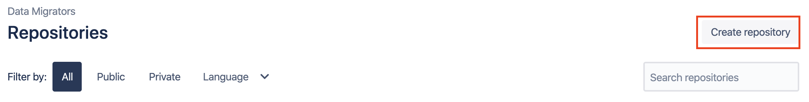
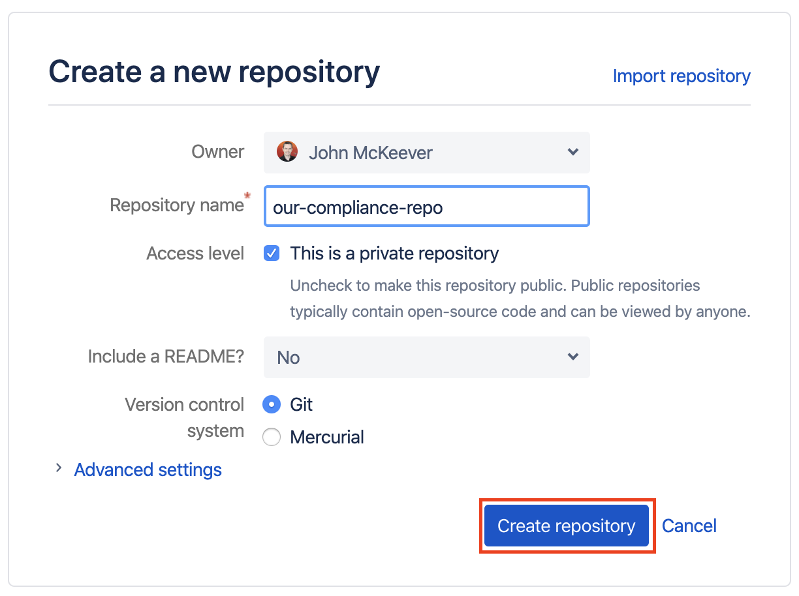
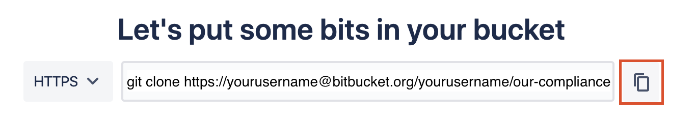

# Promoting a local Git repository to a remote repository

A Git repository (or ‘repo’) is a filesystem folder containing a `.git`
folder with a software layer (’Git') managing the files within that
folder. This repository retains a history of all changes made to files
over time. A Git repository comes in two (often related) types: Local &
Remote.

-   **Local repository:** A directory on your local filesystem - in this
    case on your DataStage Engine. When you `git commit` your code, a
    version/snapshot is created in your local repository which you then
    `git push` to a remote repository.

-   **Remote repository:** A remote repository generally lies somewhere
    outside your system, on a remote machine, and enables collaborative
    working between multiple contributors. The Remote repository is
    where developers share their code and acts as the input to
    Integration testing.

To enable you to get up and running with MettleCI Compliance with the
minimum fuss MettleCI ships with a zip file containing a **local Git
repository** of Compliance Rules. This local repository is intended to
reside in a single directory on your DataStage Engine tier, and provides
a set of template Compliance rules which you can extend, adapt, delete,
or augment as necessary. See our
<a href="Creating_a_Local_Compliance_Rule_Git_Repository"
data-linked-resource-id="506953729" data-linked-resource-version="16"
data-linked-resource-type="page">guidance on using this local Git
repository for Compliance checking</a>.

It’s possible that your organisation may be content to adapt the
supplied rules to fit your needs and leave them in a local Git
repository on your engine. Alternatively, your team may wish to promote
the local repository intro a Remote repository, which individual
developers can then clone to their individual machines and work on using
a traditional Git workflow. Instructions for doing this are provided
below.

## Commit a local repository to a remote repository

Start by creating an empty remote Git repository in your Git system of
choice and note a reference to it.

Here’s an example where we create a remote repository on Atlassian
Bitbucket Cloud …



…and copy a reference to it to our clipboard:



Now open a shell on your DataStage Engine (or wherever your Workbench is
located) and follow these steps:

``` bash
# 1
# Go to your local compliance repository directory

[user@engine ~]$ cd /opt/dm/mci/compliance

# 2
# Re-define it as a local clone of your newly-create remote repository.
# Use the remote reference to your empty Compliance repository provided by your Git system

[user@engine compliance]$ git remote add origin https://myusername@bitbucket.org/myusername/our-compliance-repo.git

# Note that if you need to subsequently re-point your repository to a different remote repository for 
# any reason (e.g. you make a mistake, or your situation changes) you can use the 'set-url' command.
# Only provided here by way of example.  You shouldn't need to run this.
# $ git remote set-url origin https://myusername@bitbucket.org/myusername/our-compliance-repo.git

# 3
# Add all the Compliance rules shipped in the Data Migrators-supplied Zip file to the staging area

[user@engine compliance]$ git add --all .

# 4
# Commit the Compliance rules you just added
# Use any commit message you like

[user@engine compliance]$ git commit -am "initial commit to remote, default rules"
[master (root-commit) 2b95553] default rules
 Committer: myusername <user@engine>
 24 files changed, 1421 insertions(+)
 create mode 100644 Adjacent Transformers.pjb.grm
 create mode 100644 CCMigrateTool Stages.pjb.grm
 create mode 100644 CCMigrateTool Stages.sjb.grm
 create mode 100644 Database Row Limit.pjb.grm
<etc.>

# 5
# Push those commits to the new remote repository

[user@engine compliance]$ git push -u origin master
Password for 'https://myusername@bitbucket.org':
Counting objects: 24, done.
Delta compression using up to 2 threads.
Compressing objects: 100% (23/23), done.
Writing objects: 100% (24/24), 20.74 KiB | 0 bytes/s, done.
Total 24 (delta 1), reused 0 (delta 0)
To https://myusername@bitbucket.org/myusername/our-compliance-repo.git
 * [new branch]      master -> master
Branch master set up to track remote branch master from origin.

# 6
# Verify the status of your local repository

[user@engine compliance]$ git show-ref
2b95553dc7572c58e12be36c4f59a52eaf61af8b refs/heads/master
2b95553dc7572c58e12be36c4f59a52eaf61af8b refs/remotes/origin/master

# Done!
```

## Retiring Your Local Compliance Repository

Once you local Compliance Rule git repo has been moved to a shared
repository you may wish to remove your local repository to prevent new
projects from using a potentially out-of-date local clone of your
Compliance rules. Follow these steps to establish that no MettleCI
projects are using the local compliance repository and remove it:

``` bash
# 1
# Go to your local compliance repository directory

[user@engine ~]$ cd /opt/dm/mci/

# 2
# Inspect your MettleCI project settings file to ensure your local
# compliance repository is no longer referenced by any MettleCI projects

[user@engine mci]$ cat project-settings.yaml
---
- id: 1
  name: "wwi_devops_develop"
  repository:
    url: "ssh://git@demo.mettleci.com:1234/mdc/wideworldimporters.git"
    branch: "develop"
    path: "datastage"
  compliance:
    url: "ssh://git@demo.mettleci.com:1234/cr/compliance-rules.git"   <-- The relevant entry
    branch: "master"
    path: ""
- id: 2
  name: "wwi_devops_hf_develop"
  repository:
    url: "ssh://git@demo.mettleci.com:1234/mdc/wideworldimporters.git"
    branch: "hotfix"
    path: "datastage"
  compliance:
    url: "ssh://git@demo.mettleci.com:1234/cr/compliance-rules.git"   <-- The relevant entry
    branch: "master"
    path: ""
- id: 3
  name: "wwiado_dev"
  repository:
    url: "git@ssh.dev.azure.com:v3/mettleci/WWI-ADO/WWI-ADO"
    branch: "hotfix"
    path: "datastage"
  compliance:
    url: "git@ssh.dev.azure.com:v3/mettleci/WWI-ADO/ado-compliance"   <-- The relevant entry
    branch: "master"
    path: ""

# ... or if you want to be smart about it:

[user@engine mci]$ awk '/compliance/{flag=1} flag && /url:/{print $NF;flag=""}' project-settings.yaml
"ssh://git@demo.mettleci.io:7999/cr/compliance-rules.git"
"ssh://git@demo.mettleci.io:7999/cr/compliance-rules.git"
"git@ssh.dev.azure.com:v3/mettleci/WWI-ADO/ado-compliance"

# All good.  No projects are using the local compliance repository.
# We're OK to remove our local compliance directory.

[user@engine mci]$ rm -rf compliance

# Done!
```

## Attachments:


[image-20200113-024301.png](attachments/507019277/502595611.png)
(image/png)  

[image-20200113-040819.png](attachments/507019277/502595631.png)
(image/png)  

[image-20200113-040838.png](attachments/507019277/507084844.png)
(image/png)  

[image-20200113-051649.png](attachments/507019277/507445259.png)
(image/png)  

[image-20200113-051837.png](attachments/507019277/502595649.png)
(image/png)  

[image-20200113-051926.png](attachments/507019277/500826389.png)
(image/png)  
