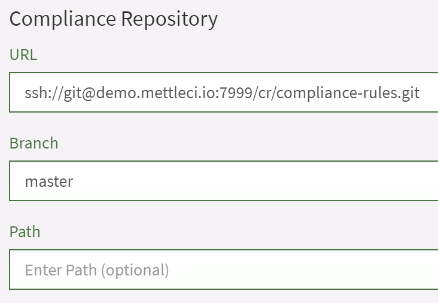

# TO DO - Setting up your Compliance Repository 🔒

Data Migrators recommends the following strategy for establishing your
Compliance repository:

# Set up a Local Repository

Set up a Local Repository on your DataStage Engine Tier. Configure
Workbench to use the Local repository to shake out Compliance.

Download the Compliance Rule zip file from
<a href="http://software.mettleci.io"
rel="nofollow">software.mettleci.io</a> and unzip into your MettleCI
Home directory:

``` java
C:\Users\Me\compliance>:: Download the compliance rules zip, presumably into your Downloads directory
C:\Users\Me\compliance>unzip -d compliance Downloads\datamigrators-compliance-rules-fa14b4baf624.zip
Archive:  Downloads/datamigrators-compliance-rules-fa14b4baf624.zip

fa14b4baf624694b17fbbd90c73d38334aee950f
   creating: datamigrators-compliance-rules-fa14b4baf624/
  inflating: datamigrators-compliance-rules-fa14b4baf624/Adjacent Transformers.pjb.grm
  inflating: datamigrators-compliance-rules-fa14b4baf624/Adjacent Transformers.sjb.grm
etc.

C:\Users\Me>
```

# Set up a Remote repository

Set up a Remote repository and add SSH key-base authentication between
your DataStage Engine Tier and and the Remote Repository

Create your repository in your Git system of choice (GitHub, GitLab,
Bitbucket, etc.) then clone it to your machine:

``` java
# Windows example
C:\Users\Me>git config --global user.name "admin"
C:\Users\Me>git config --global user.email "admin@admin.com"
C:\Users\Me>git clone http://localhost/bitbucket/scm/mci/compliance.git
Cloning into 'compliance'...
warning: You appear to have cloned an empty repository.

C:\Users\Me>
```

# Push your Local Repository

Push your Local Repository to the new Remote repository

# Reconfigure Workbench to use the Remote repository

Reconfigure Workbench to use the Remote repository



(NEED A FILESYSTEM-BASED EXAMPLE HERE TOO)

# Do you need a remote repository?

<table class="confluenceTable" data-layout="default">
<tbody>
<tr class="header">
<th class="confluenceTh"><p><strong>#</strong></p></th>
<th class="confluenceTh"><p><strong>Option</strong></p></th>
<th class="confluenceTh"><p><strong>The Good</strong></p></th>
<th class="confluenceTh"><p><strong>The Bad</strong></p></th>
</tr>
&#10;<tr class="odd">
<td class="confluenceTd"><p>1</p></td>
<td class="confluenceTd"><p>A <strong>local</strong> Git repository.
This. is simply an appropriately-configured filesystem directory,
containing your Compliance Rules, directly accessible by your MettleCI
Workbench.</p>
<p>This has a very small disk footprint and is typically (and best)
installed on your DataStage Engine tier.</p></td>
<td class="confluenceTd"><ul>
<li><p>Quick and easy to set up</p></li>
<li><p>Minimal security concerns</p></li>
<li><p>Can act as a failover solution should your remote Git service
become unavailable</p></li>
</ul></td>
<td class="confluenceTd"><ul>
<li><p>Impractical to use for collaborative development of Compliance
Rules</p></li>
<li><p>Occupies resources on your DataStage Engine tier</p></li>
<li><p>Isolated from your organisational SCM governance policies and
processes</p></li>
</ul></td>
</tr>
<tr class="even">
<td class="confluenceTd"><p>2</p></td>
<td class="confluenceTd"><p>Use a <strong>remote</strong> Git repository
hosted on a on-premises or cloud Git server (e.g. GitHub, GitLab,
Bitbucket, Azure DevOps, etc.)</p></td>
<td class="confluenceTd"><ul>
<li><p>The ‘proper’ place for Git repositories</p></li>
<li><p>Better security</p></li>
<li><p>Can facilitate collaborative development of Compliance
Rules</p></li>
<li><p>Subject to your organisational SCM governance policies and
processes</p></li>
</ul></td>
<td class="confluenceTd"><ul>
<li><p>Slightly slower and a but more more work to set up</p></li>
<li><p>Requires setup of SSH keys to support authentication</p></li>
</ul></td>
</tr>
</tbody>
</table>

You should select the option which best suits your immediate and long
term plans. Using a local repository is a shortcut to getting started
with Compliance and Git check-in, but Data Migrators recommend its use
be limited to supporting a MettleCI evaluation or as a simple means of
validating a Workbench installation before connecting to a remote
repository.

Commit the files to Git:

``` java
C:\Users\Me>cd compliance
C:\Users\Me\compliance>git add *.grm
warning: LF will be replaced by CRLF in Adjacent Transformers.pjb.grm.
The file will have its original line endings in your working directory
warning: LF will be replaced by CRLF in Adjacent Transformers.sjb.grm.
The file will have its original line endings in your working directory
etc.

C:\Users\Me\compliance>git commit -m "First version"
[master (root-commit) c78df15] First version
 63 files changed, 4397 insertions(+)
 create mode 100644 Adjacent Transformers.pjb.grm
 create mode 100644 Adjacent Transformers.sjb.grm
etc.

C:\Users\Me\compliance>git push origin master
Enumerating objects: 60, done.
Counting objects: 100% (60/60), done.
Delta compression using up to 4 threads
Compressing objects: 100% (60/60), done.
Writing objects: 100% (60/60), 55.94 KiB | 2.15 MiB/s, done.

Total 60 (delta 11), reused 0 (delta 0)
To http://localhost/bitbucket/scm/mci/compliance.git
 * [new branch]      master -> master

C:\Users\Me\compliance>:: You're done!
```

## Attachments:

 [Git
Repository Integration Options](attachments/468680880/627376153)
(application/gliffy+json)  
 [Git
Repository Integration Options.png](attachments/468680880/627376163.png)
(image/png)  
 [Git
Repository Integration Options](attachments/468680880/627867666)
(application/gliffy+json)  
 [Git
Repository Integration Options.png](attachments/468680880/627376203.png)
(image/png)  
 [Git
Repository Integration Options](attachments/468680880/791019610)
(application/gliffy+json)  
 [Git
Repository Integration Options.png](attachments/468680880/791019620.png)
(image/png)  

[image-20200317-233118.png](attachments/468680880/629571589.png)
(image/png)  
 [Git
Repository (Local)](attachments/468680880/790691876)
(application/gliffy+json)  
 [Git
Repository (Local).png](attachments/468680880/790986777.png)
(image/png)  
 [Git
Repository (Remote)](attachments/468680880/791314433)
(application/gliffy+json)  
 [Git
Repository (Remote).png](attachments/468680880/790691881.png)
(image/png)  
 [Git
Repository Integration Options](attachments/468680880/791314533)
(application/gliffy+json)  
 [Git
Repository Integration Options.png](attachments/468680880/790626460.png)
(image/png)  
 [Git
Repository Integration Options](attachments/468680880/627376143)
(application/gliffy+json)  
 [Git
Repository Integration Options.png](attachments/468680880/627376148.png)
(image/png)  

[Compliance Setup 1](attachments/468680880/802979841)
(application/gliffy+json)  

[Compliance Setup 1.png](attachments/468680880/802422789.png)
(image/png)  

[Compliance Setup 2](attachments/468680880/802488341)
(application/gliffy+json)  

[Compliance Setup 2.png](attachments/468680880/802979846.png)
(image/png)  
