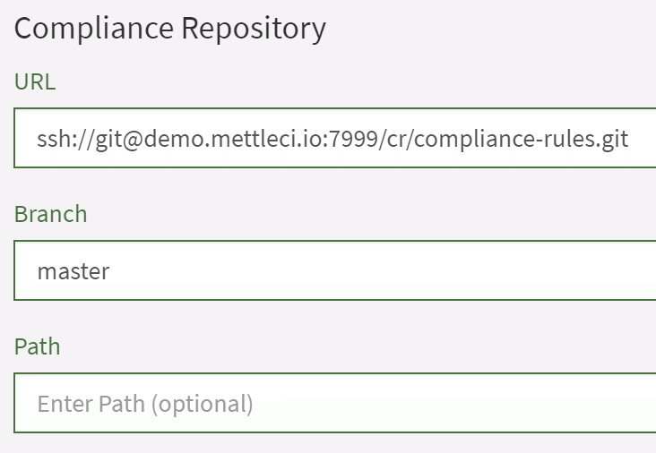

# 🔒Setting up a Remote Compliance Repository

The most common way to host a repository of Compliance Rules is on a
dedicated Git instance which is a separate host from the DataStage
Engine tier.

-   [Create a New Git
    Repository](#id-🔒SettingupaRemoteComplianceRepository-CreateaNewGitRepository)
-   [Copy your Repository’s
    URL](#id-🔒SettingupaRemoteComplianceRepository-CopyyourRepository’sURL)
-   [Unzip the MettleCI Compliance Repository
    Locally](#id-🔒SettingupaRemoteComplianceRepository-UnziptheMettleCIComplianceRepositoryLocally)
-   [Configure your Local Repository with a Remote
    Origin](#id-🔒SettingupaRemoteComplianceRepository-ConfigureyourLocalRepositorywithaRemoteOrigin)
-   [Push](#id-🔒SettingupaRemoteComplianceRepository-Push)
-   [Switch between Local and Remote
    repositories](#id-🔒SettingupaRemoteComplianceRepository-SwitchbetweenLocalandRemoterepositories)

## Create a New Git Repository

Create your repository in your Git system of choice (GitHub, GitLab,
Bitbucket, etc.) The steps required to do this vary between each system.
Please see your system-specific documentation for details.

## Copy your Repository’s URL 

Get a new Git repository in your chosen Git platform and get an
appropriate link from its interface:

GitLab


## Unzip the MettleCI Compliance Repository Locally

``` java
C:\Users\Me>cd compliance
C:\Users\Me\compliance>git add *.grm
warning: LF will be replaced by CRLF in Adjacent Transformers.pjb.grm.
The file will have its original line endings in your working directory
warning: LF will be replaced by CRLF in Adjacent Transformers.sjb.grm.
The file will have its original line endings in your working directory
etc.

C:\Users\Me\compliance>git commit -m "First version"
[master (root-commit) c78df15] First version
 63 files changed, 4397 insertions(+)
 create mode 100644 Adjacent Transformers.pjb.grm
 create mode 100644 Adjacent Transformers.sjb.grm
etc.
```

A good place to do this is your DataStage Engine tier: If your Git
server becomes unavailable for any reason then (with a simple 30-second
configuration change in Workbench) you’ll be able to continue running
MettleCI Compliance using a your Engine Tier’s local copy of the
Compliance Rules until your Git server becomes available once more. See
the ***<u>instructions below</u>*** for how to swap between local and
remote repositories in MettleCI Workbench.

## Configure your Local Repository with a Remote Origin

Before you can start using git commands you’ll need to configure your
Git credentials.

Set your username:
`git config --global user.name "my_forname my_surname"`

And your email address:
`git config --global user.email "my_username@example.com"`

Now configure your local Git repository with a remote origin:
`git remote set-url origin git@bitbucket.org:mettleci/compliance.git`

Now check your remote Origin has been configured correctly:
`git remote -v`

## Push

`git push origin master`

Bitbucket


Then…

Windows

``` java
# Windows example
C:\Users\Me>git config --global user.name "my_user_name"
C:\Users\Me>git config --global user.email "my_user_name@mycompany.com"
# Paste your Git clone command here
C:\Users\Me>git clone http://my_git_host/mci/compliance.git
Cloning into 'compliance'...
warning: You appear to have cloned an empty repository.

C:\Users\Me>
```

Unix

Download the Compliance Rule zip file from
<a href="http://software.mettleci.io"
rel="nofollow">software.mettleci.io</a> and unzip unto the Git
repository directory:

``` java
C:\Users\Me\compliance>:: Download the compliance rules zip, presumably into your Downloads directory
C:\Users\Me\compliance>unzip -d compliance Downloads\datamigrators-compliance-rules-fa14b4baf624.zip
Archive:  Downloads/datamigrators-compliance-rules-fa14b4baf624.zip

fa14b4baf624694b17fbbd90c73d38334aee950f
   creating: datamigrators-compliance-rules-fa14b4baf624/
  inflating: datamigrators-compliance-rules-fa14b4baf624/Adjacent Transformers.pjb.grm
  inflating: datamigrators-compliance-rules-fa14b4baf624/Adjacent Transformers.sjb.grm
etc.

C:\Users\Me>
```

Commit the files to Git:

``` java

C:\Users\Me\compliance>git push origin master
Enumerating objects: 60, done.
Counting objects: 100% (60/60), done.
Delta compression using up to 4 threads
Compressing objects: 100% (60/60), done.
Writing objects: 100% (60/60), 55.94 KiB | 2.15 MiB/s, done.

Total 60 (delta 11), reused 0 (delta 0)
To http://localhost/bitbucket/scm/mci/compliance.git
 * [new branch]      master -> master

C:\Users\Me\compliance>:: You're done!
```

## Switch between Local and Remote repositories

If you Git server becomes unavailable for any reason then (with a simple
30-second configuration change in Workbench) you’ll be able to continue
running Compliance until your Git server becomes available once more.

Swapping between local and remote Git
Compliance repositories

To set MettleCI to use a local Compliance repository for your DataStage
project you just need to point Workbench to the appropriate repository.
Under your user icon (top right) in Workbench select **Manage Projects**
and under **Compliance Repository** set the **URL** field to an
appropriate value following the examples below. In all cases leave the
**Branch** field as `master` and the **Path** field empty.

``` java
# Windows Engine Tier
file://C:\MettleCI\compliance\.git

# Unix Engine Tier
file:///opt/dm/mci/compliance/.git
```

To swap back to a remote repository just set the URL to a value
following these examples./

``` java
# All Engine Tiers
ssh://my_username@my_company.com:7999/mettleci/compliance.git
```



Note that if you use this technique to point to a local you’ll be
running Compliance against the version of your Compliance repository
stored locally on your DataStage Engine tier. If you’ve committed
changes to the ‘real’ (remote) Compliance repository then these will
only be reflected in the local repository if they've been explicitly
fetched with a `git pull` command.

## Attachments:


[image-20200317-233118.png](attachments/790724649/790724655.png)
(image/png)  
 [Git
Repository Integration Options.png](attachments/790724649/790724658.png)
(image/png)  
 [Git
Repository Integration Options](attachments/790724649/790724661)
(application/gliffy+json)  
 [Remote
Git Repository](attachments/790724649/791019556)
(application/gliffy+json)  
 [Remote
Git Repository.png](attachments/790724649/790724692.png) (image/png)  

[image-20200605-035520.png](attachments/790724649/790724699.png)
(image/png)  

[image-20200605-035808.png](attachments/790724649/790691896.png)
(image/png)  
